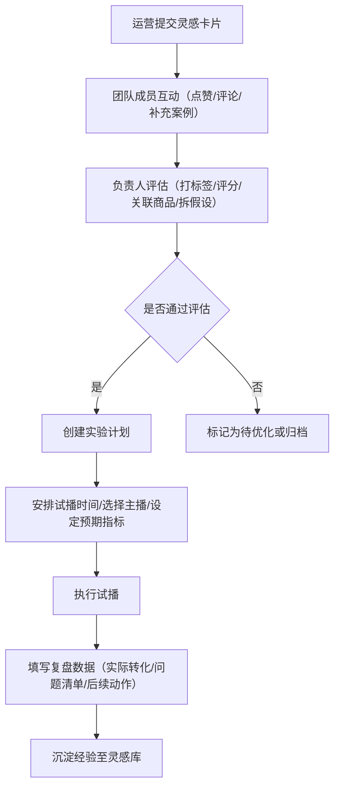

# 产品灵感管理系统 PRD

## 1. 产品概述
为内容电商团队打造的一站式灵感管理平台，解决直播间玩法、活动主题和商品组合创意散落在聊天记录中的痛点。通过结构化记录、团队协作、实验验证和复盘沉淀的全流程管理，让好点子真正落地转化。

- **核心价值**：将碎片化灵感转化为可执行、可验证、可沉淀的创意资产
- **目标用户**：内容电商运营团队（运营专员、团队成员、负责人）
- **产品定位**：电商直播创意管理与实验验证平台

## 2. 核心功能

### 2.1 用户角色
| 角色 | 权限说明 |
|------|----------|
| 运营 | 提交灵感卡片，填写基础信息（标题、节日、人群、链接、素材、成本） |
| 团队成员 | 点赞、收藏、评论、补充相似案例 |
| 负责人 | 打标签、可行性评分、关联商品池、拆解待验证假设 |

### 2.2 功能模块
1. **灵感广场**：瀑布流展示所有灵感卡片，支持筛选、搜索、排序
2. **采集箱**：个人收藏的灵感，可分类整理
3. **灵感详情**：完整信息展示、互动区、团队协作、负责人专属操作
4. **实验计划**：安排试播时间、选择主播、记录预期指标
5. **复盘页**：填写实际转化数据、问题清单、后续动作

### 2.3 页面详情
| 页面名称 | 模块名称 | 功能描述 |
|---------|---------|---------|
| 灵感广场 | 顶部导航 | Logo、搜索框、筛选标签、新建灵感按钮、用户头像 |
| 灵感广场 | 瀑布流卡片墙 | 灵感卡片网格（封面、标题、标签、点赞收藏数、可行性评分） |
| 灵感广场 | 侧边筛选栏 | 按节日、人群、标签、成本区间、评分筛选 |
| 采集箱 | 分类导航 | 全部、节日专题、人群定向、玩法类型 |
| 采集箱 | 灵感列表 | 收藏的灵感卡片，支持批量操作和移除 |
| 灵感详情 | 基础信息区 | 标题、封面图、适用节日、目标人群、参考链接、素材图片、预估成本 |
| 灵感详情 | 团队互动区 | 点赞、收藏、评论区、相似案例补充 |
| 灵感详情 | 负责人操作区 | 标签管理、可行性评分（1-10分）、商品池关联、假设拆解 |
| 灵感详情 | 时间线 | 灵感从提交到复盘的全流程记录 |
| 实验计划 | 排期日历 | 试播时间安排视图 |
| 实验计划 | 计划卡片 | 关联灵感、试播时间、主播、预期指标、状态标记 |
| 实验计划 | 主播选择器 | 主播列表及档期查看 |
| 复盘页 | 数据对比区 | 预期指标 vs 实际转化数据 |
| 复盘页 | 问题清单 | 遇到的问题及严重程度标记 |
| 复盘页 | 后续动作 | Action Item 列表，负责人和截止日期 |
| 复盘页 | 复盘总结 | 经验沉淀和可复用建议 |

## 3. 核心流程

### 主流程描述
运营人员在灵感广场提交创意灵感 → 团队成员互动讨论、补充案例 → 负责人评估打标、关联商品、拆解假设 → 创建实验计划安排试播 → 执行试播后填写复盘数据 → 沉淀经验形成可复用资产

## 4. 用户界面设计

### 4.1 设计风格
- **主色调**：深靛蓝 `#1E1B4B`（专业、信任），搭配活力橙 `#F97316`（创意、行动）
- **辅助色**：翡翠绿 `#10B981`（成功）、玫瑰红 `#F43F5E`（警示）、琥珀黄 `#F59E0B`（提醒）
- **中性色**：石板灰系列（文字、背景、边框）
- **按钮风格**：圆角 8px，主要按钮使用渐变，带微妙悬停动效
- **字体**：标题使用「思源黑体 Heavy」，正文使用「思源黑体 Regular」，配合「JetBrains Mono」处理数字数据
- **布局风格**：卡片式布局 + 侧边导航，采用现代 Bento Grid 设计语言
- **图标风格**：Lucide 线性图标，搭配创意类 Emoji 增加趣味性

### 4.2 页面设计概述
| 页面名称 | 模块名称 | UI 元素 |
|---------|---------|---------|
| 灵感广场 | Hero 搜索区 | 大型搜索框、热门标签云、快捷筛选按钮 |
| 灵感广场 | 卡片瀑布流 | 毛玻璃效果卡片、悬停放大动效、渐入加载动画 |
| 灵感详情 | 分栏布局 | 左侧主内容区 + 右侧信息面板，背景使用渐变网格纹理 |
| 灵感详情 | 时间线 | 纵向时间轴，节点带动画弹出效果 |
| 实验计划 | 日历视图 | 周视图日历，实验计划以彩色事件块展示 |
| 复盘页 | 数据卡片 | 对比仪表盘，数据卡片有发光效果突出关键指标 |

### 4.3 响应式
- 桌面端优先设计（≥1280px），采用三栏布局
- 平板端（768-1279px）：自适应双栏布局，侧边栏可收起
- 移动端（<768px）：单栏布局，底部 Tab 导航，卡片纵向排列
