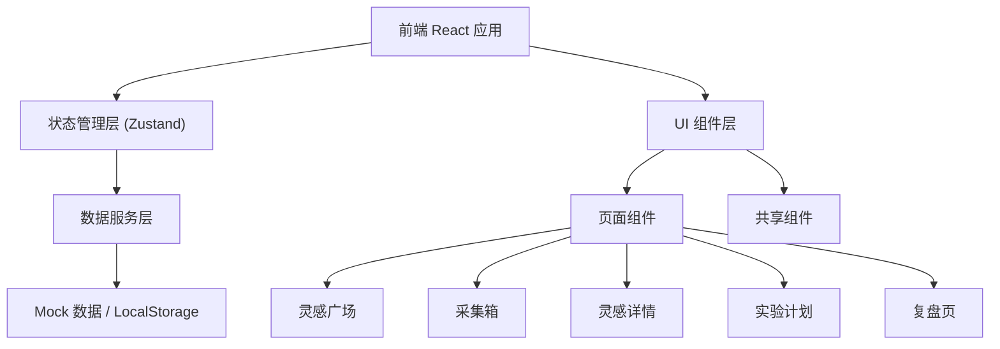

# 产品灵感管理系统 技术架构文档

## 1. 架构设计



## 2. 技术描述

- **前端框架**：React 18 + TypeScript
- **构建工具**：Vite 5
- **样式方案**：Tailwind CSS 3
- **状态管理**：Zustand 4
- **路由方案**：React Router DOM 6
- **图标库**：Lucide React
- **数据持久化**：LocalStorage（无后端，纯前端 Mock 数据）

## 3. 路由定义

| 路由路径 | 页面组件 | 页面说明 |
|---------|---------|---------|
| `/` | InspirationSquare | 灵感广场首页 |
| `/collection` | CollectionBox | 采集箱页面 |
| `/inspiration/:id` | InspirationDetail | 灵感详情页面 |
| `/experiments` | ExperimentPlan | 实验计划页面 |
| `/retrospective/:experimentId` | Retrospective | 复盘页面 |

## 4. 数据模型

### 4.1 数据模型定义

```mermaid
erDiagram
    INSPIRATION {
        string id PK
        string title
        string description
        string coverImage
        string festival
        string targetAudience
        string referenceLinks
        string materialImages
        number estimatedCost
        string status
        number feasibilityScore
        array tags
        array relatedProducts
        array hypotheses
        number likes
        number favorites
        string creatorId
        string createdAt
        string updatedAt
    }
    
    COMMENT {
        string id PK
        string inspirationId FK
        string userId
        string userName
        string content
        string createdAt
    }
    
    SIMILAR_CASE {
        string id PK
        string inspirationId FK
        string title
        string description
        string url
    }
    
    EXPERIMENT {
        string id PK
        string inspirationId FK
        string title
        string scheduledTime
        string anchorId
        string anchorName
        object expectedMetrics
        object actualMetrics
        string status
        string createdAt
    }
    
    RETROSPECTIVE {
        string id PK
        string experimentId FK
        array issues
        array actionItems
        string summary
        string createdAt
    }
    
    PRODUCT {
        string id PK
        string name
        string category
        number price
        string image
    }
    
    INSPIRATION ||--o{ COMMENT : has
    INSPIRATION ||--o{ SIMILAR_CASE : has
    INSPIRATION ||--o{ EXPERIMENT : generates
    EXPERIMENT ||--|| RETROSPECTIVE : has
    INSPIRATION }o--o{ PRODUCT : related
```



### 4.2 TypeScript 类型定义

```typescript
// 灵感状态
type InspirationStatus = 'draft' | 'reviewing' | 'approved' | 'experimenting' | 'completed' | 'archived';

// 灵感卡片
interface Inspiration {
  id: string;
  title: string;
  description: string;
  coverImage: string;
  festival: string;
  targetAudience: string;
  referenceLinks: string[];
  materialImages: string[];
  estimatedCost: number;
  status: InspirationStatus;
  feasibilityScore: number | null;
  tags: string[];
  relatedProducts: string[];
  hypotheses: string[];
  likes: number;
  isLiked: boolean;
  favorites: number;
  isFavorited: boolean;
  creatorId: string;
  creatorName: string;
  creatorAvatar: string;
  createdAt: string;
  updatedAt: string;
}

// 评论
interface Comment {
  id: string;
  inspirationId: string;
  userId: string;
  userName: string;
  userAvatar: string;
  content: string;
  createdAt: string;
}

// 相似案例
interface SimilarCase {
  id: string;
  inspirationId: string;
  title: string;
  description: string;
  url: string;
}

// 商品
interface Product {
  id: string;
  name: string;
  category: string;
  price: number;
  image: string;
}

// 实验计划
interface Experiment {
  id: string;
  inspirationId: string;
  title: string;
  scheduledTime: string;
  anchorId: string;
  anchorName: string;
  expectedMetrics: {
    views: number;
    engagement: number;
    conversion: number;
    gmv: number;
  };
  actualMetrics?: {
    views: number;
    engagement: number;
    conversion: number;
    gmv: number;
  };
  status: 'scheduled' | 'ongoing' | 'completed' | 'cancelled';
  createdAt: string;
}

// 复盘
interface RetrospectiveData {
  id: string;
  experimentId: string;
  issues: Array<{
    id: string;
    description: string;
    severity: 'low' | 'medium' | 'high';
  }>;
  actionItems: Array<{
    id: string;
    task: string;
    assignee: string;
    dueDate: string;
    completed: boolean;
  }>;
  summary: string;
  createdAt: string;
}
```

## 5. 目录结构

```
src/
├── components/          # 共享组件
│   ├── layout/         # 布局组件（Sidebar, TopNav）
│   ├── ui/             # 基础 UI 组件（Button, Card, Tag, Modal 等）
│   └── features/       # 业务组件（InspirationCard, CommentList 等）
├── pages/              # 页面组件
│   ├── InspirationSquare/
│   ├── CollectionBox/
│   ├── InspirationDetail/
│   ├── ExperimentPlan/
│   └── Retrospective/
├── store/              # Zustand 状态管理
│   └── index.ts
├── types/              # TypeScript 类型定义
│   └── index.ts
├── data/               # Mock 数据
│   └── mockData.ts
├── utils/              # 工具函数
│   └── helpers.ts
├── App.tsx
├── main.tsx
└── index.css
```
